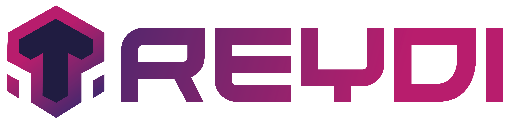

<!-- Add your project logo if you have any -->

<h1 align="center"><b>JavaFX PIDEV PROJECT</b></h1>
	<!-- Add your project live demo link here -->
    <a href="https://github.com/github_username/github_repo_link">View Demo</a>
    ·
	<!-- Add you issue link here -->
    <a href="https://github.com/github_username/github_repo_link/issues">Report Bug</a>
    ·
	<!-- Add you issue/discussion link here too -->
    <a href="https://github.com/github_username/github_repo_link/issues">Request Feature</a>
     
    
    

 

 	<!-- Add your tagline or very short intro of your project -->
   
  

<!-- ABOUT THE PROJECT -->
## 🧐 About The Project
![template][product-screenshot]

Une plate-forme qui permet aux utilisateurs l'échange d'articles (physiques, virtuels ou de services) avec d'autres utilisateurs.

Here's why:
* Item par Item,
* Item par Service,
* Service par Service.

## 💡Modules

La liste préliminaire des Modules 

1. Responsive
1. Supports Dark and Light Mode

(<a href="#readme-top">back to top</a>)

------------------------------------------------------------------------------------------------------------------------------------------------------------------------

Nom Groupe : Eni

Théme : Troc

Sujet : Echange des Items

------------------------------------------------------------------------------------------------------------------------------------------------------------------------

■ | Presentation Soft-Skills 

☐ | JDBC

------------------------------------------------------------------------------------------------------------------------------------------------------------------------

Les branches :

Mohamed Dhia Jebali : https://github.com/MDJ-GitHub/Treydi/tree/Mohamed_Dhia_Jebali

Mohamed Oussama Bouriga : https://github.com/MDJ-GitHub/Treydi/tree/mohamed_oussama_bouriga

Moez ben Hassen : https://github.com/MDJ-GitHub/Treydi/tree/moezBenHassen

Kalthoum Dridi : https://github.com/MDJ-GitHub/Treydi/tree/Kalthoum_Dridi

Marouan Ayed : https://github.com/MDJ-GitHub/Treydi/tree/Marouan_Ayed

Mohamed Adem Torkhani : https://github.com/MDJ-GitHub/Treydi/tree/Mohamed_Adem_Torkhani

[product-screenshot]: maq.png