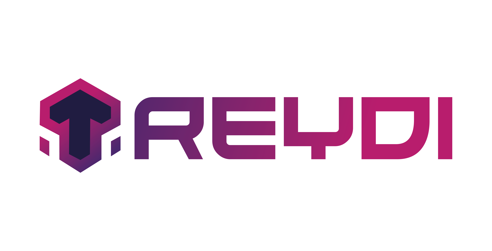

<!-- Add your project logo if you have any -->

<h1 align="center">PIDEV PROJECT</h1>

 

 	<!-- Add your tagline or very short intro of your project -->
	Your project tagline/short description here
     
	<!-- Add your project live demo link here -->
    <a href="https://github.com/github_username/github_repo_link">View Demo</a>
    ·
	<!-- Add you issue link here -->
    <a href="https://github.com/github_username/github_repo_link/issues">Report Bug</a>
    ·
	<!-- Add you issue/discussion link here too -->
    <a href="https://github.com/github_username/github_repo_link/issues">Request Feature</a>
  

<!-- ABOUT THE PROJECT -->
## About The Project

[![Product Name Screen Shot][product-screenshot]](https://example.com)

There are many great README templates available on GitHub; however, I didn't find one that really suited my needs so I created this enhanced one. I want to create a README template so amazing that it'll be the last one you ever need -- I think this is it.

Here's why:
* Your time should be focused on creating something amazing. A project that solves a problem and helps others
* You shouldn't be doing the same tasks over and over like creating a README from scratch
* You should implement DRY principles to the rest of your life :smile:

Of course, no one template will serve all projects since your needs may be different. So I'll be adding more in the near future. You may also suggest changes by forking this repo and creating a pull request or opening an issue. Thanks to all the people have contributed to expanding this template!

Use the `BLANK_README.md` to get started.

(<a href="#readme-top">back to top</a>)

------------------------------------------------------------------------------------------------------------------------------------------------------------------------

Nom Groupe : Eni

Théme : Troc

Sujet : Echange des Items

------------------------------------------------------------------------------------------------------------------------------------------------------------------------

■ | Presentation Soft-Skills 

☐ | JDBC

------------------------------------------------------------------------------------------------------------------------------------------------------------------------

Les branches :

Mohamed Dhia Jebali : https://github.com/MDJ-GitHub/Treydi/tree/Mohamed_Dhia_Jebali

Mohamed Oussama Bouriga : https://github.com/MDJ-GitHub/Treydi/tree/mohamed_oussama_bouriga

Moez ben Hassen : https://github.com/MDJ-GitHub/Treydi/tree/moezBenHassen

Kalthoum Dridi : https://github.com/MDJ-GitHub/Treydi/tree/Kalthoum_Dridi

Marouan Ayed : https://github.com/MDJ-GitHub/Treydi/tree/Marouan_Ayed

Mohamed Adem Torkhani : https://github.com/MDJ-GitHub/Treydi/tree/Mohamed_Adem_Torkhani

[product-screenshot]: desk.png